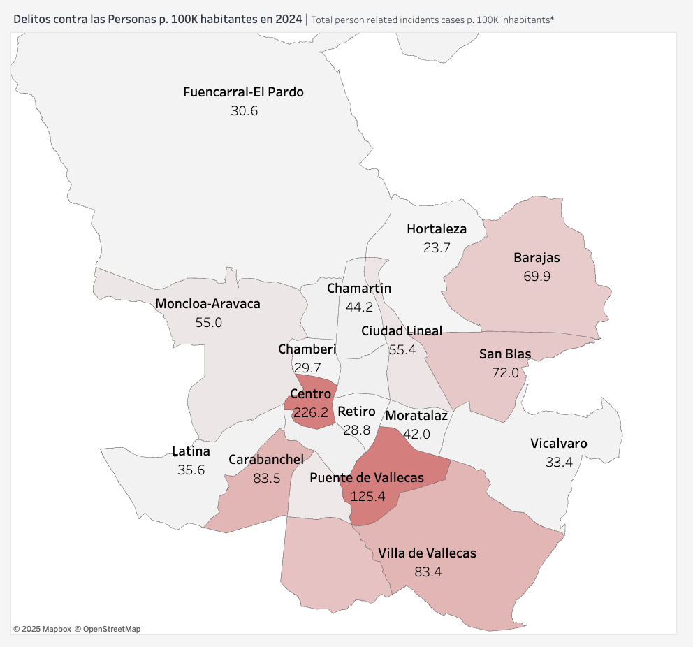
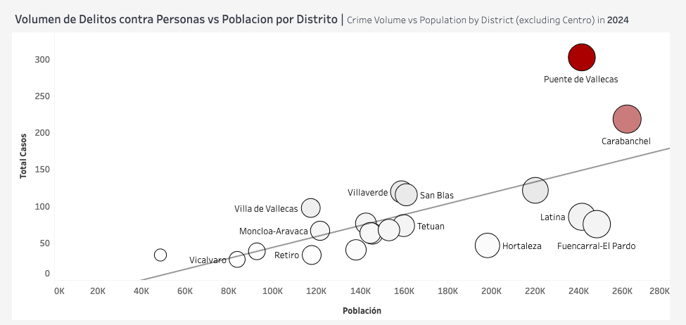
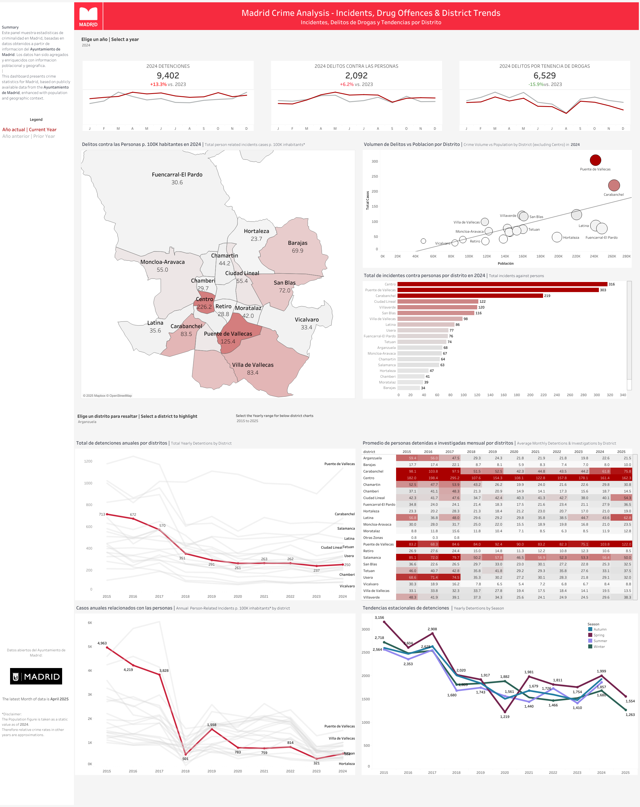

#  Madrid Crime Analytics Dashboard

**By: Felix Stiefel – Senior Data Analyst based in Madrid**

---

## 🔍 Project Overview

This is an interactive Tableau dashboard visualizing **12 years of Madrid crime data**, categorized by:
- Crime type
- District
- Time trends (monthly, yearly)
- Heatmaps by location

The goal of this project is to enable deeper insights into public safety trends in Madrid — and make the data accessible to citizens, journalists, and researchers.

---

## 📊 Live Dashboard

👉 **[View the dashboard on Tableau Public](https://public.tableau.com/app/profile/felix.stiefel/viz/MadridCrimeAnalysis/MainDashboard)**

---

## 📈 Why This Project?

Madrid media has occasionally published short-term crime trend stories, often based on 1–2 months of data.

This dashboard is unique because it:
- Covers a **multi-year time frame**
- Offers **district-level granularity**
- Allows **public interaction** with data
- Is fully **open and free to use**

The project also gained **11,000 views on Reddit in 4 days** with a 99% upvote ratio. 🧠

---

## 📁 Dataset

- 📅 Time period: 2018–2023
- 📍 Granularity: By month, by district
- 📦 Source: Ayuntamiento de Madrid open data portal
- 🧹 Cleaned, standardized, and joined into a single dataset

---

## 📰 For Media / Journalists

This project is open and free. I’m happy to:
- Share raw visuals
- Provide quotes or commentary
- Collaborate on a specific angle or story

📬 **[Email me](mailto:felixstiefel18@gmail.com)** or connect on [LinkedIn](https://www.linkedin.com/in/felix-stiefel/)

---

## 🧠 Tools Used

- Python (pandas) for data cleaning and EDA  
- Tableau for dashboard

---

## 🖼️ Screenshots

### Incidents/Population

### Dashboard

---

## 📌 About Me

I'm a Senior Data Analyst working for a U.S. tech company and currently based in Madrid. This is a personal project aimed at combining data journalism, open data, and public value.

---
