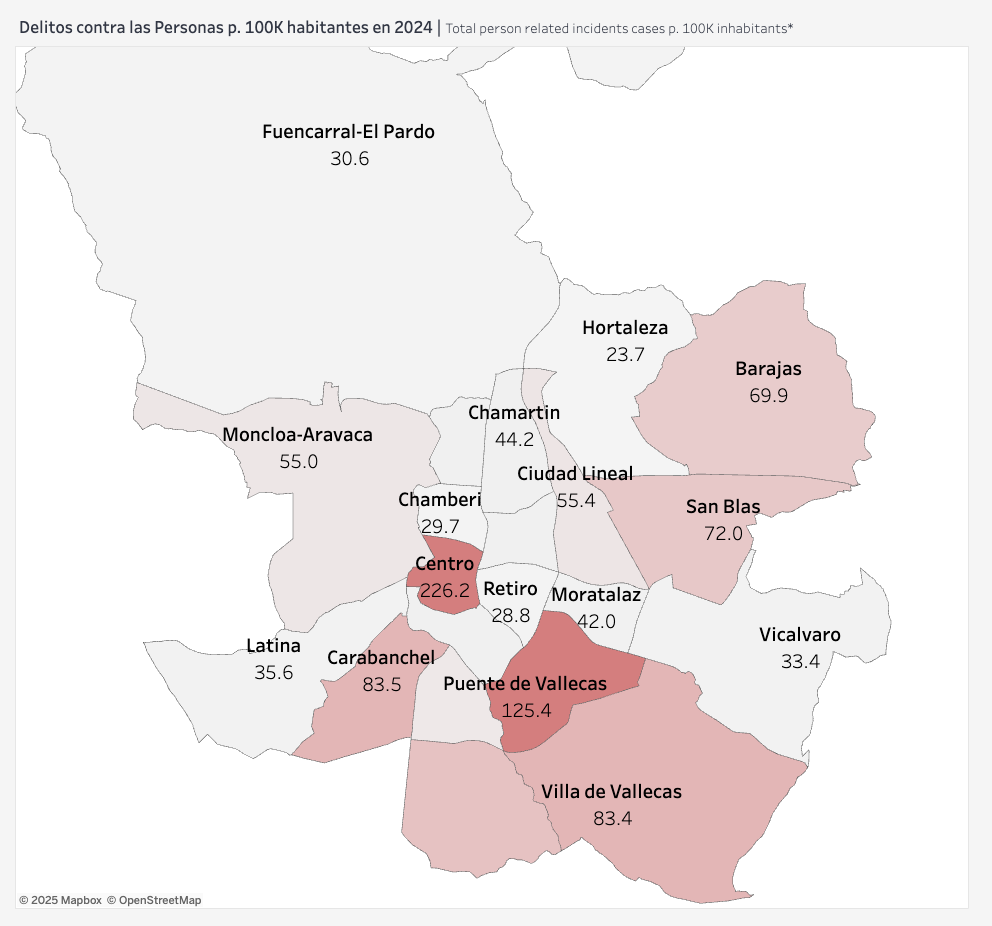
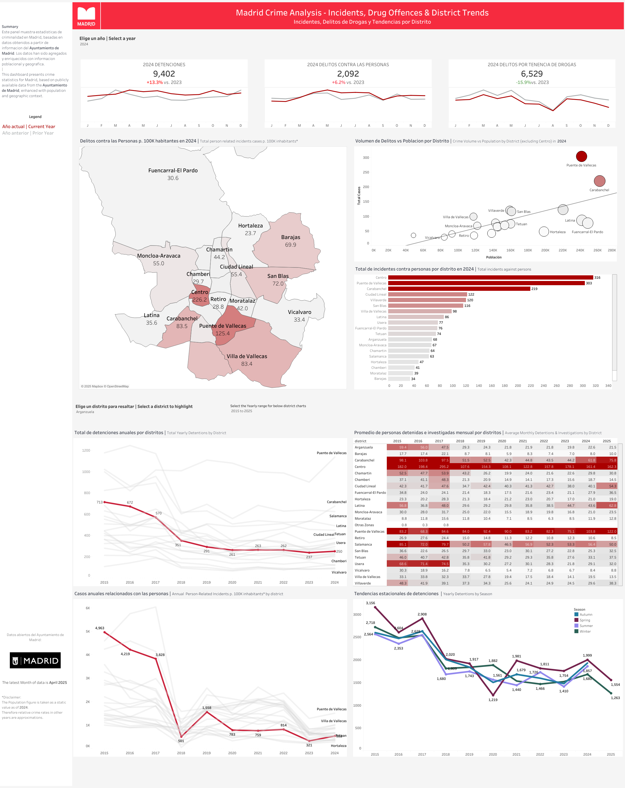

# 🕵️‍♂️ Panel de Análisis de Criminalidad en Madrid

**Por: Felix Stiefel – Senior Data Analyst con sede en Madrid**

---

## 🔍 Resumen del Proyecto

Este es un panel interactivo en Tableau que visualiza **12 años de datos de criminalidad en Madrid**, clasificados por:
- Tipo de delito  
- Distrito  
- Tendencias temporales (mensuales y anuales)  
- Mapas de calor por ubicación

El objetivo de este proyecto es ofrecer una visión más profunda de las tendencias de seguridad pública en Madrid y hacer los datos accesibles a ciudadanos, periodistas e investigadores.

---

## 📊 Panel Interactivo

👉 **[Ver el panel en Tableau Public](https://public.tableau.com/app/profile/felix.stiefel/viz/MadridCrimeAnalysis/MainDashboard)**

---

## 📈 ¿Por qué este proyecto?

Los medios madrileños han publicado ocasionalmente noticias sobre tendencias delictivas a corto plazo, basadas generalmente en 1 o 2 meses de datos.

Este panel es único porque:
- Cubre un **periodo de varios años**
- Ofrece **detalle a nivel de distrito**
- Permite la **interacción pública** con los datos
- Es completamente **abierto y gratuito**

El proyecto también obtuvo **11.000 visitas en Reddit en solo 4 días**, con un 99% de votos positivos. 🧠

---

## 📁 Conjunto de Datos

- 📅 Periodo: 2018–2023  
- 📍 Granularidad: Por mes y por distrito  
- 📦 Fuente: Portal de datos abiertos del Ayuntamiento de Madrid  
- 🧹 Datos limpiados, estandarizados y consolidados en un único conjunto

---

## 📰 Para Medios / Periodistas

Este proyecto es completamente abierto y gratuito. Estoy encantado de:
- Compartir gráficos o visualizaciones  
- Ofrecer declaraciones o comentarios  
- Colaborar en un enfoque o historia específica

📬 **[Contáctame por correo](mailto:felixstiefel18@gmail.com)** o conéctate en [LinkedIn](https://www.linkedin.com/in/felix-stiefel/)

---

## 🧠 Herramientas Utilizadas

- Python (pandas) para limpieza de datos y análisis exploratorio  
- Tableau para el panel interactivo

---

## 🖼️ Capturas de Pantalla

### Incidentes por Población  

### Panel Interactivo  

Esta solución se publica bajo la licencia Creative Commons BY-NC 4.0. Por favor, acredita a Felix Stiefel al utilizarla.

---

## 📌 Sobre Mí

Soy un Senior Data Analyst que trabaja para una empresa tecnológica de EE. UU. y actualmente resido en Madrid. Este es un proyecto personal con el objetivo de combinar el periodismo de datos, los datos abiertos y el valor público.

---
